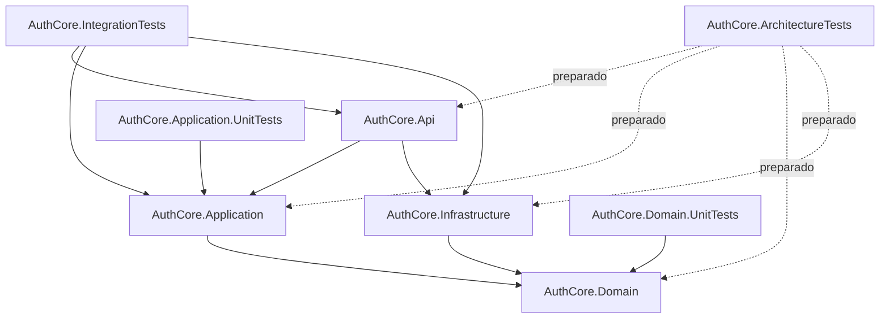

# Architecture Overview

## Objetivo

Este documento oficializa a visão arquitetural do projeto `auth_core` com base no estado real do repositório. O objetivo é registrar a organização da solução, o papel de cada camada, os padrões dominantes de implementação e as diretrizes que devem orientar a evolução do código.

O projeto implementa um núcleo de autenticação em `.NET 8`, organizado em camadas, com forte influência de Clean Architecture e DDD tático. A principal fonte de verdade para linguagem, modelagem e estilo é a camada `AuthCore.Domain`.

Este documento adota o recorte **atual + preparado**:

- a arquitetura implementada hoje é a base da documentação
- estruturas já previstas para crescimento são registradas como capacidade preparada, e não como funcionalidade plenamente explorada

## Visão Geral da Solução

A solução está organizada em duas áreas principais:

- `src/Backend/AuthCore`: projetos de aplicação
- `tests`: projetos de validação automatizada

Os projetos atualmente presentes na solução são:

- `AuthCore.Api`
- `AuthCore.Application`
- `AuthCore.Domain`
- `AuthCore.Infrastructure`
- `AuthCore.Domain.UnitTests`
- `AuthCore.Application.UnitTests`
- `AuthCore.IntegrationTests`
- `AuthCore.ArchitectureTests`

Os quatro primeiros formam o núcleo funcional da aplicação. Os projetos de teste exercem comportamentos do domínio, casos de uso da aplicação, bootstrap e fluxos integrados. `AuthCore.ArchitectureTests` existe na solução como espaço preparado para testes arquiteturais, mas ainda sem implementação relevante no estado atual.

## Estilo Arquitetural

O projeto segue uma composição em camadas com responsabilidades bem delimitadas:

- `Api` atua como borda HTTP
- `Application` orquestra casos de uso
- `Domain` concentra regras de negócio, contratos centrais e tipos de domínio
- `Infrastructure` implementa persistência, segurança e demais detalhes técnicos

Essa organização é reforçada por duas decisões estruturais importantes:

- a regra de negócio central permanece no domínio
- a infraestrutura depende do domínio por contratos, sem puxar a modelagem para fora dele

Na prática, a solução combina:

- **Clean Architecture**, ao manter o domínio e a aplicação isolados de detalhes técnicos
- **DDD tático**, ao modelar agregados, value objects, invariantes e contratos de repositório
- **vertical slices na aplicação**, ao organizar casos de uso por módulo e responsabilidade
- **separação de leitura e escrita**, especialmente na infraestrutura PostgreSQL

## Fluxo de Dependências

O fluxo de dependência implementado hoje é o seguinte:

- `AuthCore.Api -> AuthCore.Application`
- `AuthCore.Api -> AuthCore.Infrastructure`
- `AuthCore.Application -> AuthCore.Domain`
- `AuthCore.Infrastructure -> AuthCore.Domain`
- os projetos de teste dependem da camada que exercitam

Uma regra importante da solução é que **`AuthCore.Application` não depende diretamente de `AuthCore.Infrastructure`**. A aplicação trabalha apenas com contratos do domínio, enquanto a infraestrutura fornece implementações concretas por injeção de dependência.

## Responsabilidade por Camada

### AuthCore.Domain

A camada `AuthCore.Domain` é a principal referência do projeto. Ela concentra:

- agregados e entidades base
- value objects
- enums e tipos de apoio ao negócio
- contratos de repositório
- exceções de domínio
- contratos de segurança, como criptografia de senha e geração de tokens

Os módulos de negócio hoje aparecem principalmente em:

- `Users`
- `Passports`
- `Security`
- `Common`

Exemplos concretos do padrão dominante:

- `User` representa a conta de usuário e concentra comportamento como atualização de perfil e mudanças de estado
- `Password` modela a credencial do usuário com regras de validação, bloqueio e troca de senha
- `Email` protege invariantes do endereço de e-mail como value object

O domínio usa factories estáticas como `Create`, `Register`, `Restore` e `Read` para controlar criação, reconstrução e materialização de entidades.

### AuthCore.Application

A camada `AuthCore.Application` atua como orquestradora. Ela não deve se tornar a dona das regras centrais do negócio. Sua responsabilidade é coordenar:

- casos de uso
- leitura e gravação por meio de contratos de repositório
- início e finalização de transações
- montagem de resultados de aplicação

O padrão predominante é vertical slice por módulo e caso de uso. Cada fatia tende a reunir:

- interface do caso de uso
- implementação do caso de uso
- `Command` ou `Query`
- `Result`, quando há retorno estruturado

Exemplos reais:

- `Users/UseCases/RegisterUser`
- `Users/UseCases/GetUserProfile`
- `Users/UseCases/ChangePassword`
- `Authentication/UseCases/Login`
- `Authentication/UseCases/RefreshSession`

### AuthCore.Api

A camada `AuthCore.Api` é fina e adaptadora. Ela recebe HTTP, converte entrada em comandos ou consultas, invoca a aplicação e devolve JSON.

As responsabilidades observadas hoje incluem:

- controllers HTTP
- contratos de request e response com sufixo `Json`
- autenticação JWT
- tratamento global de exceções
- health check de banco
- Swagger em ambiente de desenvolvimento

Os controllers atuais seguem o papel correto de borda:

- `AuthController` atende autenticação, renovação e logout de sessão
- `UserController` atende registro, perfil, atualização, troca de senha e exclusão

### AuthCore.Infrastructure

A camada `AuthCore.Infrastructure` implementa detalhes técnicos sem absorver regra de negócio. Hoje ela concentra:

- persistência PostgreSQL com `Npgsql`
- SQL explícito em raw strings
- separação entre leitura e escrita
- `UnitOfWork` e sessão transacional compartilhada
- migrações com `FluentMigrator`
- implementação de criptografia com BCrypt
- geração e renovação de tokens
- classes de configuração para banco, JWT, Redis e RabbitMQ

Mesmo quando a infraestrutura materializa agregados de domínio, ela faz isso respeitando o modelo central, normalmente por meio de factories como `Restore(...)`.

### Camada de Testes

Os testes estão organizados em projetos específicos por foco:

- `AuthCore.Domain.UnitTests`: comportamento e invariantes do domínio
- `AuthCore.Application.UnitTests`: comportamento de casos de uso e orquestração
- `AuthCore.IntegrationTests`: bootstrap, autenticação, persistência e fluxos integrados
- `AuthCore.ArchitectureTests`: espaço preparado para validações arquiteturais futuras

O estado atual mostra maturidade especialmente em domínio, aplicação e integração. O projeto de arquitetura ainda está apenas reservado na solução.

## Fluxos Arquiteturais Principais

### Fluxo HTTP de ponta a ponta

O fluxo principal da aplicação segue esta sequência:

1. a API recebe a requisição HTTP
2. o controller converte o payload para `Command` ou `Query`
3. o caso de uso da aplicação coordena a operação
4. o domínio aplica regras de negócio, invariantes e transições de estado
5. os repositórios acessam leitura ou escrita conforme a necessidade
6. a unidade de trabalho controla a transação quando a operação exige consistência
7. a aplicação retorna um resultado
8. a API adapta esse resultado para response JSON

Esse fluxo pode ser visto com clareza em operações como:

- registro de usuário
- login
- atualização de perfil
- troca de senha

### Pipeline de bootstrap

O bootstrap é centralizado no `Program.cs` da API e segue este encadeamento:

1. `AddApi(builder.Configuration)`
2. `AddInfrastructure(builder.Configuration)`
3. `AddApplication()`
4. `Build()`
5. `ApplyInfrastructureMigrationsAsync()`
6. configuração do pipeline HTTP com exception handler, autenticação, autorização, health checks e controllers

Esse fluxo mostra que:

- a API é o ponto de entrada do processo
- a infraestrutura é registrada no startup, mas permanece acessada via contratos
- as migrações podem ser aplicadas automaticamente na inicialização, conforme configuração

## Padrões Dominantes do Código

O padrão de implementação do repositório é bastante consistente. As convenções mais visíveis hoje são:

- `namespace` file-scoped
- classes concretas frequentemente `sealed`
- interfaces com prefixo `I`
- uso consistente de `async/await`
- dependências injetadas por construtor
- campos privados como `private readonly`
- helpers privados concentrados ao final da classe
- documentação XML pública em português

A ordem de membros mais comum é:

1. constantes e campos privados
2. propriedades
3. construtores
4. métodos públicos
5. métodos privados

No domínio, também é dominante o uso de:

- construtores privados para controlar a criação
- fábricas estáticas como `Create`, `Register`, `Restore` e `Read`
- validação interna do estado
- encapsulamento com `private set`
- value objects para proteger invariantes

Existe ainda algum legado residual em pontos mais antigos da base comum, especialmente em tipos como `EntityBase`, cuja escrita e padronização de documentação XML não seguem integralmente o padrão mais recente do projeto. Esse traço deve ser entendido como histórico de evolução, e não como referência para código novo.

## Persistência, Segurança e Infraestrutura Transversal

### Persistência

A persistência usa PostgreSQL com `Npgsql` e SQL explícito. Não há uso de ORM no estado atual.

O desenho atual separa repositórios de leitura e escrita, o que traz vantagens como:

- maior clareza de responsabilidade
- consultas específicas por finalidade
- menor acoplamento entre materialização e gravação

Exemplo do padrão:

- `UserReadRepository` resolve consultas e remonta o agregado por `User.Restore(...)`
- `UserRepository` cuida de `AddAsync`, `UpdateAsync` e `DeleteAsync`

### Transação e sessão de banco

O projeto usa `IDatabaseSession` e `IUnitOfWork` com implementação compartilhada em `NpgsqlUnitOfWork`. Isso permite:

- manter uma conexão aberta por escopo
- compartilhar a transação atual entre repositórios
- iniciar, confirmar e desfazer transações na camada de aplicação

Esse padrão reforça o papel da aplicação como coordenadora transacional, enquanto a infraestrutura executa os detalhes técnicos do acesso a dados.

### Segurança

Na parte de segurança, a solução implementa hoje:

- criptografia de senha com BCrypt
- autenticação JWT
- geração de access token
- gerenciamento de refresh token

Os contratos ficam no domínio e as implementações concretas ficam na infraestrutura. Isso preserva a independência do modelo central em relação à biblioteca técnica utilizada.

### Migrações e configuração

As migrações são controladas com `FluentMigrator`, usando classes versionadas como `Version0000001`, `Version0000002` e assim por diante. A infraestrutura também possui opções fortemente tipadas para:

- banco de dados
- migrações
- autenticação JWT
- Redis
- RabbitMQ

Redis e RabbitMQ já aparecem como capacidades estruturadas na configuração da solução, mas ainda não sustentam, no estado atual, serviços de negócio relevantes equivalentes ao nível de materialização já visto em persistência PostgreSQL, tokens e criptografia.

## Estratégia de Testes

A estratégia de testes atual é distribuída por camada e responsabilidade.

### Domínio

`AuthCore.Domain.UnitTests` cobre invariantes e comportamento do núcleo, com foco em agregados e value objects como:

- `Password`
- `RefreshToken`
- `LoginAttempt`
- `Email`

Esse é o conjunto mais alinhado ao papel central da camada de domínio.

### Aplicação

`AuthCore.Application.UnitTests` valida o comportamento dos casos de uso, especialmente a coordenação entre repositórios, dependências e transações.

### Integração

`AuthCore.IntegrationTests` cobre cenários de integração e bootstrap, incluindo:

- montagem do pipeline de dependências
- autenticação
- persistência de refresh token
- tratamento de exceções

Esse projeto ajuda a garantir que a composição entre `Api`, `Application` e `Infrastructure` está funcional.

### Arquitetura

`AuthCore.ArchitectureTests` existe na solução como placeholder. Isso indica uma intenção arquitetural saudável de evoluir para validações automatizadas de dependência, convenções e fronteiras entre camadas, mas essa prática ainda não está materializada no código atual.

## Diretrizes de Evolução

Mudanças futuras devem preservar os princípios já consolidados na solução:

- regra de negócio central pertence ao `Domain`
- a `Application` orquestra fluxos e transações
- a `Api` adapta entrada e saída HTTP
- a `Infrastructure` implementa detalhes técnicos

Ao evoluir o sistema:

- novas regras devem ser modeladas no domínio antes de serem distribuídas em camadas externas
- novos casos de uso devem seguir o padrão de vertical slice na aplicação
- novos endpoints devem manter controllers finos e contratos `Request...Json` e `Response...Json`
- novas integrações técnicas devem respeitar o fluxo atual de dependências
- novos documentos e novas implementações devem seguir o padrão recente da `Domain`, inclusive na documentação XML pública em português quando aplicável

Também é recomendado evitar dois desvios comuns:

- levar regra de negócio para controllers, services utilitários ou infraestrutura
- introduzir dependência direta de `Application` para `Infrastructure`

## Leitura Final

O projeto `auth_core` já possui uma identidade arquitetural clara. A solução combina um domínio forte, aplicação orquestradora, API fina e infraestrutura explícita, com convenções de código previsíveis e boa separação de responsabilidades.

Em resumo, o padrão dominante do repositório hoje é:

**código C# orientado a domínio, com arquitetura em camadas, orquestração por casos de uso, persistência manual em PostgreSQL, documentação padronizada em português e preparação estrutural para crescimento sem romper o núcleo de negócio.**
